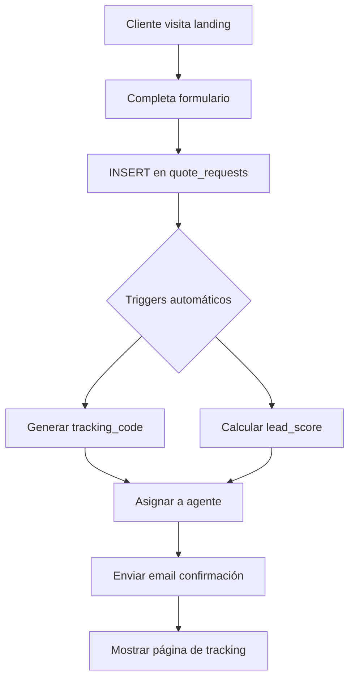

# Documentación del Sistema de Administración LYTU

## 📋 Introducción

El Sistema de Administración LYTU es una plataforma completa para gestionar leads, cotizaciones y clientes de una agencia de desarrollo de software. Utiliza **Supabase** como backend completo (base de datos, autenticación y almacenamiento) y **React/Next.js** como frontend.

---

## 🏗️ Arquitectura del Sistema

### Stack Tecnológico

- **Frontend**: React/Next.js + Tailwind CSS
- **Backend**: Supabase (PostgreSQL, Auth, Storage, Realtime)
- **Base de Datos**: PostgreSQL 15 con Row Level Security (RLS)
- **Hosting**: Vercel (frontend) + Supabase (backend)

### Diagrama de Arquitectura

```
┌─────────────────┐     ┌─────────────────┐     ┌─────────────────┐
│   Frontend      │     │    Supabase     │     │   PostgreSQL    │
│   React/Next.js │────▶│    Gateway      │────▶│     Database    │
│                 │     │                 │     │                 │
├─────────────────┤     ├─────────────────┤     ├─────────────────┤
│  Landing Page   │     │  Authentication │     │   Tablas (13)   │
│  Admin Panel    │     │     Storage     │     │   Vistas (2)    │
│  Tracking Page  │     │    Realtime     │     │  Funciones (15) │
│                 │     │  Edge Functions │     │   Triggers (6)  │
└─────────────────┘     └─────────────────┘     └─────────────────┘
```

---

## 📊 Base de Datos: Tablas y Estructura

### 1. **admin_users** - Usuarios del Sistema

**Propósito**: Gestionar el equipo interno de LYTU

```sql
Campos principales:
- id: UUID (relacionado con auth.users)
- email: Correo del usuario
- name: Nombre completo
- role: 'admin', 'manager', 'agent'
- is_active: Estado activo/inactivo
- last_login: Último acceso
```

**Relaciones**:

- `id` → `auth.users.id` (one-to-one)
- Referenciada por: `quote_requests.assigned_to`, `clients.assigned_to`

### 2. **quote_requests** - Solicitudes de Cotización

**Propósito**: Almacenar todas las solicitudes del formulario web

```sql
Campos clave:
- tracking_code: LYTU-001-2024 (generado automáticamente)
- public_tracking_id: UUID para seguimiento público
- budget_range: '<1500', '1500-4000', '4000-8000', '8000+'
- lead_score: Puntuación automática (0-100)
- status: 'new', 'viewed', 'analyzing', 'contacted', 'quoted', 'won', 'lost'
- selected_systems: Array de sistemas seleccionados
```

**Triggers asociados**:

- `generate_tracking_code`: Genera código único
- `calculate_lead_score`: Calcula puntuación automática

### 3. **quote_timeline** - Historial de Seguimiento

**Propósito**: Registrar todas las interacciones con cada lead

```sql
Campos importantes:
- action_type: 'status_change', 'note_added', 'file_uploaded', 'email_sent'
- internal_note: BOOLEAN (no visible para clientes)
- file_urls: Array de URLs de archivos adjuntos
```

### 4. **formal_quotes** - Cotizaciones Formales

**Propósito**: Cotizaciones detalladas enviadas a clientes

```sql
Estructura:
- quote_number: Q-001-2024 (generado automático)
- items: JSONB con items de la cotización
- subtotal, tax_amount, total: Campos monetarios
- pdf_url: Enlace al PDF generado
- status: 'draft', 'sent', 'viewed', 'accepted', 'rejected'
```

### 5. **clients** - Sistema CRM

**Propósito**: Gestionar la relación con clientes

```sql
Campos principales:
- status: 'lead', 'prospect', 'client', 'inactive', 'lost'
- source: 'website', 'referral', 'social_media'
- tags: Array de etiquetas para segmentación
- converted_from_quote: Relación con quote_requests
```

### 6. **client_interactions** - Interacciones CRM

**Propósito**: Registrar todas las comunicaciones con clientes

```sql
Tipos de interacción:
- type: 'email', 'call', 'meeting', 'note', 'task'
- direction: 'inbound', 'outbound'
- attachments: Archivos adjuntos
```

### 7. **web_analytics** - Análisis de Tráfico

**Propósito**: Trackear visitas al sitio web

```sql
Datos capturados:
- session_id, visitor_id: Identificadores únicos
- page_url, referrer: Origen de la visita
- device_type, browser, os: Datos técnicos
- country, city, ip_address: Datos geográficos
```

### 8. **page_events** - Eventos de Página

**Propósito**: Capturar interacciones específicas

```sql
Eventos soportados:
- event_type: 'pageview', 'scroll', 'click', 'form_start', 'form_abandon'
- scroll_depth: Porcentaje de scroll (0-100)
- form_data: Datos parciales del formulario
```

### 9. **form_analytics** - Análisis de Formularios

**Propósito**: Medir performance de formularios

```sql
Métricas:
- status: 'started', 'abandoned', 'completed'
- abandoned_step: Paso donde se abandonó
- completion_time: Tiempo en segundos
```

### 10. **system_config** - Configuración del Sistema

**Propósito**: Configuración global del sistema

```sql
Ejemplos de configuraciones:
- budget_ranges: Rangos de presupuesto
- timeline_options: Opciones de tiempo
- email_templates: Plantillas de correo
- system_modules: Módulos disponibles
```

---

## ⚙️ Funciones de Base de Datos

### 1. **Funciones de Generación Automática**

#### `generate_tracking_code()`

**Propósito**: Generar código de tracking único (LYTU-001-2024)
**Uso**: Trigger antes de INSERT en `quote_requests`

```sql
Ejemplo: LYTU-045-2024
```

#### `generate_quote_number()`

**Propósito**: Generar número de cotización (Q-001-2024)
**Uso**: Trigger antes de INSERT en `formal_quotes`

### 2. **Funciones de Cálculo**

#### `calculate_lead_score()`

**Propósito**: Calcular puntuación automática del lead
**Factores considerados**:

- Presupuesto (25 puntos máx)
- Urgencia (15 puntos máx)
- Número de sistemas seleccionados (5 c/u)
- Preferencia de contacto (5 puntos)
- Detalles adicionales (5 puntos)

**Escala de prioridad**:

- Alto: > 40 puntos
- Medio: 20-40 puntos
- Bajo: < 20 puntos

### 3. **Funciones de Asignación**

#### `assign_quote_to_agent(quote_id UUID)`

**Propósito**: Asignar cotización automáticamente usando round-robin
**Lógica**:

1. Busca agentes activos
2. Cuenta asignaciones de los últimos 7 días
3. Asigna al agente con menos asignaciones
4. Si no hay agentes, asigna a admin

### 4. **Funciones de Dashboard**

#### `get_dashboard_stats(start_date DATE, end_date DATE)`

**Propósito**: Obtener estadísticas para el dashboard
**Métricas retornadas**:

- Total de solicitudes
- Tasa de conversión
- Score promedio de leads
- Distribución por presupuesto
- Ingreso estimado

#### `get_form_abandonment_analytics(days_back INTEGER)`

**Propósito**: Analizar abandono de formularios
**Datos**:

- Tasa de abandono por formulario
- Paso más común de abandono
- Tiempo promedio hasta abandono

### 5. **Funciones de Tracking Público**

#### `get_public_timeline(public_id UUID)`

**Propósito**: Obtener timeline visible para el cliente
**Filtros**: Excluye `internal_note = TRUE`

### 6. **Funciones de Conversión**

#### `create_client_from_quote(quote_id UUID)`

**Propósito**: Convertir cotización ganada en cliente
**Acciones**:

1. Crea registro en `clients`
2. Actualiza estado de cotización a 'won'
3. Registra evento en timeline

---

## 🗂️ Buckets de Almacenamiento (Supabase Storage)

### 1. **lytu-documents** (Principal)

**Propósito**: Almacenar documentos relacionados con cotizaciones
**Estructura de carpetas**:

```
lytu-documents/
├── quotes/
│   ├── {quote_id}/
│   │   ├── logos/
│   │   │   └── logo-cliente.png
│   │   ├── attachments/
│   │   │   └── documento.pdf
│   │   └── proposals/
│   │       └── propuesta.pdf
│   └── formal/
│       └── Q-001-2024.pdf
├── clients/
│   └── {client_id}/
│       ├── contracts/
│       └── documents/
└── templates/
    ├── proposal-template.docx
    └── contract-template.pdf
```

**Políticas de acceso**:

- **Público**: Solo lectura para archivos específicos
- **Team**: Lectura/escritura para el equipo
- **Admin**: Control total

### 2. **lytu-public** (Opcional)

**Propósito**: Archivos estáticos del sitio web
**Contenido**:

- Imágenes del portfolio
- Logos de clientes (con permiso)
- Documentos públicos

---

## 🔄 Flujos Principales del Sistema

### Flujo 1: Captación y Procesamiento de Lead



**Eventos en tiempo real**:

- Nuevo lead aparece en dashboard admin
- Notificación push para agentes asignados
- Actualización automática de contadores

### Flujo 2: Gestión Interna de Cotización

```
Estado: new → viewed → analyzing → contacted → quoted → (won|lost)

Acciones por estado:
1. new: Asignación automática, primera notificación
2. viewed: Agente marca como visto, timeline update
3. analyzing: Revisión de requerimientos, preguntas de clarificación
4. contacted: Comunicación con cliente, registro de interacción
5. quoted: Generación de propuesta formal, envío PDF
6. won: Conversión a cliente, inicio de proyecto
7. lost: Registro de razón, feedback
```

### Flujo 3: Conversión a Cliente CRM

```sql
-- Proceso automático al ganar cotización
SELECT create_client_from_quote('quote_id');

-- Resultado:
1. Nuevo registro en tabla clients
2. Estado actualizado en quote_requests
3. Timeline entry creado
4. Email de bienvenida enviado
```

### Flujo 4: Seguimiento Público

```
URL: https://lytu.dev/tracking/{public_tracking_id}

Vista del cliente incluye:
1. Estado actual de la cotización
2. Timeline de eventos (sin notas internas)
3. Documentos compartidos
4. Formulario para preguntas adicionales

Seguridad:
- Solo acceso con public_tracking_id válido
- No requiere autenticación
- No expone información sensible
```

---

## 🎯 Panel de Administración - Módulos

### Módulo 1: Dashboard Principal

**Componentes**:

- **Stats Cards**: Leads nuevos, en contacto, convertidos
- **Revenue Chart**: Ingreso estimado por mes
- **Lead Quality**: Distribución por lead_score
- **Activity Feed**: Últimas interacciones
- **Quick Actions**: Asignaciones pendientes

**Endpoint principal**: `get_dashboard_stats()`

### Módulo 2: Gestión de Cotizaciones

**Vistas disponibles**:

1. **Listado Grid**: Filtros avanzados, búsqueda, ordenamiento
2. **Vista Detalle**: Información completa + timeline
3. **Editor de Propuestas**: Formulario WYSIWYG para cotizaciones
4. **Bulk Actions**: Actualización masiva de estados

**Acciones por lead**:

- Cambiar estado
- Reasignar agente
- Agregar nota interna/pública
- Subir documentos
- Generar propuesta PDF
- Convertir a cliente

### Módulo 3: CRM de Clientes

**Funcionalidades**:

- **Base de datos centralizada**: Todos los contactos
- **Pipeline visual**: Etapas de venta personalizables
- **Recordatorios automáticos**: Seguimientos programados
- **Segmentación**: Etiquetas y filtros avanzados
- **Historial completo**: Todas las interacciones

**Relaciones automáticas**:

- Cotizaciones → Clientes
- Interacciones → Clientes
- Proyectos → Clientes

### Módulo 4: Analytics Avanzadas

**Métricas trackeadas**:

**Web Analytics**:

- Visitantes únicos, sesiones, rebote
- Origen de tráfico (UTM, referrers)
- Dispositivos y navegadores
- Tiempo en página, páginas/visita

**Form Analytics**:

- Tasa de conversión por formulario
- Tiempo de completado promedio
- Campos con mayor abandono
- Dispositivos de mayor conversión

**Lead Analytics**:

- Fuente de mejores leads
- Presupuesto promedio por fuente
- Tiempo de respuesta óptimo
- Estacionalidad de leads

### Módulo 5: Gestión de Equipo

**Funcionalidades**:

- **Roles y permisos**: Admin, Manager, Agent
- **Dashboard individual**: Métricas por agente
- **Asignación automática**: Round-robin inteligente
- **Seguimiento de actividad**: Logs de todas las acciones

**Métricas por agente**:

- Leads asignados vs convertidos
- Tiempo promedio de respuesta
- Tasa de conversión personal
- Satisfacción del cliente

### Módulo 6: Configuración del Sistema

**Ajustes configurables**:

```json
{
  "quotes": {
    "budget_ranges": ["<1500", "1500-4000", "4000-8000", "8000+"],
    "statuses": ["new", "contacted", "quoted", "won", "lost"],
    "default_assignment": "round_robin"
  },
  "email": {
    "templates": {
      "quote_received": "Plantilla de confirmación",
      "quote_ready": "Plantilla de propuesta lista"
    },
    "sender": "LYTU <cotizaciones@lytu.dev>"
  },
  "crm": {
    "client_statuses": ["lead", "prospect", "client", "inactive"],
    "automatic_followup_days": 3
  }
}
```

---

## 🔐 Sistema de Seguridad y Permisos

### Row Level Security (RLS) Implementado

**Políticas principales**:

1. **admin_users**:

   - Usuarios ven solo su propio registro
   - Admins ven todos los usuarios

2. **quote_requests**:

   - Público: Solo INSERT (crear nuevas)
   - Team: SELECT, UPDATE en sus asignados o todos (según rol)

3. **quote_timeline**:

   - Team: Acceso completo
   - Público: Solo `internal_note = FALSE` vía función

4. **clients**:

   - Team: Acceso según asignación
   - Relación con cotizaciones respetada

5. **web_analytics, page_events, form_analytics**:
   - Público: Solo INSERT (tracking)
   - Team: SELECT completo para análisis

### Roles y Permisos

| Permiso                    | Admin | Manager | Agent               |
| -------------------------- | ----- | ------- | ------------------- |
| Ver todas las cotizaciones | ✅    | ✅      | ❌ (solo asignadas) |
| Crear/editar usuarios      | ✅    | ❌      | ❌                  |
| Ver analytics completas    | ✅    | ✅      | ✅                  |
| Configurar sistema         | ✅    | ❌      | ❌                  |
| Convertir leads a clientes | ✅    | ✅      | ✅                  |
| Eliminar registros         | ✅    | ❌      | ❌                  |

---

## 📈 Sistema de Scoring de Leads

### Fórmula de Cálculo

```
lead_score = base_score + budget_score + urgency_score + completeness_score

Donde:
- base_score = 5 (puntos base)
- budget_score = 5-25 puntos según rango
- urgency_score = 8-15 puntos según timeline
- completeness_score = 0-15 puntos (sistemas + detalles + contacto)
```

### Rangos y Prioridad

| Score | Prioridad | Tiempo Respuesta Objetivo |
| ----- | --------- | ------------------------- |
| 40+   | Alta      | < 2 horas                 |
| 20-39 | Media     | < 24 horas                |
| <20   | Baja      | < 48 horas                |

### Factores que incrementan score:

1. **Presupuesto alto** (8000+ = 25 puntos)
2. **Urgencia inmediata** (urgent = 10 puntos)
3. **Múltiples sistemas** (5 puntos c/u)
4. **Contacto directo** (WhatsApp/call = 5 puntos)
5. **Descripción detallada** (>10 chars = 5 puntos)

---

## 🔄 Integración Frontend-Backend

### Estructura de API Calls

**Frontend React → Supabase**:

```javascript
// 1. Configuración inicial
import { createClient } from "@supabase/supabase-js";
const supabase = createClient(SUPABASE_URL, SUPABASE_ANON_KEY);

// 2. Ejemplos de consultas comunes
const api = {
  // Cotizaciones
  getQuotes: (filters) => supabase.from("quote_requests").select("*", filters),
  createQuote: (data) => supabase.from("quote_requests").insert([data]),
  updateQuote: (id, updates) =>
    supabase.from("quote_requests").update(updates).eq("id", id),

  // CRM
  getClients: () => supabase.from("clients").select("*"),
  logInteraction: (data) => supabase.from("client_interactions").insert([data]),

  // Analytics
  trackPageView: (data) => supabase.from("web_analytics").insert([data]),
  trackFormEvent: (data) => supabase.from("form_analytics").insert([data]),

  // Funciones RPC
  getDashboardStats: () => supabase.rpc("get_dashboard_stats"),
  assignQuote: (quoteId) =>
    supabase.rpc("assign_quote_to_agent", { quote_id: quoteId }),
};
```

### Hooks React Personalizados

```javascript
// hooks/useQuotes.js
export function useQuotes(filters = {}) {
  const [quotes, setQuotes] = useState([]);
  const [loading, setLoading] = useState(true);

  useEffect(() => {
    fetchQuotes();
    const subscription = supabase
      .channel("quotes-channel")
      .on(
        "postgres_changes",
        { event: "*", schema: "public", table: "quote_requests" },
        () => fetchQuotes()
      )
      .subscribe();

    return () => supabase.removeChannel(subscription);
  }, [filters]);

  const fetchQuotes = async () => {
    let query = supabase.from("quote_requests").select("*");
    // Aplicar filtros...
    const { data } = await query;
    setQuotes(data);
    setLoading(false);
  };

  return { quotes, loading, refetch: fetchQuotes };
}
```

### Componente de Dashboard Ejemplo

```jsx
// components/Dashboard/StatsOverview.jsx
export default function StatsOverview() {
  const [stats, setStats] = useState(null);

  useEffect(() => {
    loadStats();
  }, []);

  const loadStats = async () => {
    const { data } = await supabase.rpc("get_dashboard_stats", {
      start_date: "2024-01-01",
      end_date: "2024-12-31",
    });
    setStats(data);
  };

  return (
    <div className="stats-grid">
      <StatCard title="Leads Nuevos" value={stats?.new_requests} />
      <StatCard title="Tasa Conversión" value={`${stats?.conversion_rate}%`} />
      <StatCard title="Score Promedio" value={stats?.avg_lead_score} />
      <StatCard
        title="Ingreso Estimado"
        value={`$${stats?.total_revenue_estimate}`}
      />
    </div>
  );
}
```

---

## 🚀 Flujo de Deployment y Mantenimiento

### 1. Setup Inicial

```bash
# 1. Crear proyecto en Supabase
# 2. Ejecutar script SQL completo en SQL Editor
# 3. Configurar Authentication providers
# 4. Crear buckets de storage
# 5. Configurar variables de entorno en frontend

# Variables de entorno necesarias:
NEXT_PUBLIC_SUPABASE_URL=https://xyz.supabase.co
NEXT_PUBLIC_SUPABASE_ANON_KEY=eyJhbGciOiJIUzI1NiIsInR5cCI6IkpXVCJ9...
SUPABASE_SERVICE_ROLE_KEY=eyJhbGciOiJIUzI1NiIsInR5cCI6IkpXVCJ9... # Solo backend
```

### 2. Mantenimiento Diario

```sql
-- Monitoreo de performance
SELECT * FROM pg_stat_activity WHERE state = 'active';

-- Limpieza de sesiones expiradas
DELETE FROM web_analytics WHERE entered_at < NOW() - INTERVAL '30 days';

-- Backup automático configurado en Supabase
```

### 3. Monitoreo de Salud

**Métricas a vigilar**:

- Tasa de error en INSERT de formularios
- Tiempo de respuesta de consultas
- Uso de almacenamiento
- Actividad de usuarios concurrentes

**Alertas configuradas**:

- Más de 5% de errores en formularios
- Tiempo de respuesta > 2s en consultas críticas
- Storage > 80% de capacidad

---

## 📋 Checklist de Implementación

### Fase 1: Infraestructura (Día 1-2)

- [x] Proyecto Supabase creado
- [x] Base de datos inicializada con script
- [x] Authentication configurado
- [x] Storage buckets creados
- [x] Variables de entorno configuradas

### Fase 2: Frontend Core (Día 3-5)

- [x] Landing page con formulario funcional
- [x] Página de tracking público
- [x] Sistema de autenticación admin
- [x] Dashboard básico con estadísticas

### Fase 3: Funcionalidades Completas (Día 6-10)

- [x] Gestión completa de cotizaciones
- [x] Sistema CRM básico
- [x] Analytics de formularios
- [x] Notificaciones en tiempo real

### Fase 4: Optimización (Día 11-14)

- [x] Performance optimizations
- [x] Testing completo
- [x] Documentación
- [x] Deployment a producción

---

## 🔧 Troubleshooting Común

### Problema: Error en triggers

```sql
-- Verificar triggers activos
SELECT tgname, tgrelid::regclass
FROM pg_trigger
WHERE NOT tgisinternal;

-- Recrear trigger si es necesario
DROP TRIGGER IF EXISTS calculate_lead_score_trigger ON quote_requests;
CREATE TRIGGER calculate_lead_score_trigger
  BEFORE INSERT OR UPDATE ON quote_requests
  FOR EACH ROW EXECUTE FUNCTION calculate_lead_score();
```

### Problema: RLS bloqueando operaciones

```sql
-- Verificar políticas activas
SELECT schemaname, tablename, policyname, permissive, roles, cmd
FROM pg_policies
WHERE tablename = 'quote_requests';

-- Diagnosticar problema específico
EXPLAIN ANALYZE INSERT INTO quote_requests (...) VALUES (...);
```

### Problema: Performance lenta

```sql
-- Índices recomendados adicionales
CREATE INDEX idx_quotes_status_created ON quote_requests(status, created_at DESC);
CREATE INDEX idx_clients_email_status ON clients(email, status);

-- Limpiar analytics antiguos
DELETE FROM web_analytics WHERE entered_at < NOW() - INTERVAL '90 days';
DELETE FROM page_events WHERE timestamp < NOW() - INTERVAL '90 days';
```

---

## 📞 Soporte y Contacto

**Para soporte técnico**:

1. Revisar logs en Supabase Dashboard → Logs
2. Verificar triggers y funciones en SQL Editor
3. Contactar al administrador de base de datos

**Documentación adicional**:

- [Supabase Documentation](https://supabase.com/docs)
- [React-Supabase Integration](https://supabase.com/docs/guides/getting-started/quickstarts/reactjs)
- [RLS Best Practices](https://supabase.com/docs/guides/auth/row-level-security)

---

**Última actualización**: Enero 2024  
**Versión del sistema**: 2.0.0  
**Responsable**: Equipo de Desarrollo LYTU

_Esta documentación está viva y se actualiza con cada cambio importante en el sistema._
